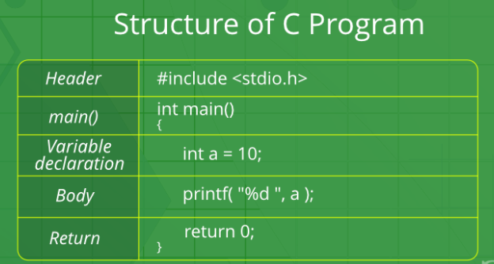

# **C** Programming Language Fundamentals

### ***C*** is a procedural programming language. It was initially developed by Dennis Ritchie between 1969 and 1973. It was mainly developed as a system programming language to write operating system. The main features of ***C*** language include low-level access to memory, simple set of keywords, and clean style, these features make ***C*** language suitable for system programming like operating system or compiler development. Many later languages have borrowed syntax/features directly or indirectly from ***C*** language.

---
## Structure of **C** Program

---
#### 1. Header Files Inclusion: The first and foremost component is the inclusion of the Header files in a C program. A header file is a file with extension .h which contains C function declarations and macro definitions to be shared between several source files.

**Syntax to include a header file in C:**

\#include <(header_file_name).h>

***Example:***
* stdio.h  - Defines core input and output functions
